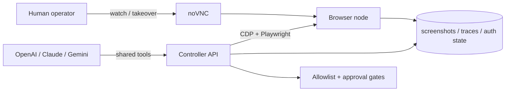

# Browser Operator POC

A visual browser-operator proof of concept for LLM-driven workflows.

This scaffold gives you:
- a **browser node** with Chromium, Xvfb, x11vnc, and noVNC
- a **controller API** built on FastAPI + Playwright
- **screen-aware observations** with screenshots and interactable element IDs
- **human takeover** through noVNC
- **artifact capture** for screenshots, traces, and storage state
- **basic policy rails** with host allowlists and upload approval gates
- provider adapters for **OpenAI, Claude, and Gemini** behind one internal action schema
- one-step and multi-step **agent orchestration endpoints**
- a browser-node generated **shared ws-endpoint file** so the controller can attach even when Chrome advertises `127.0.0.1` in CDP metadata

It is intentionally **not** a stealth or anti-bot system. It is for operator-assisted browser workflows on sites and accounts you are authorized to use.

## Architecture at a glance



See `docs/architecture.md` for the full design and `docs/llm-adapters.md` for the model-facing action loop.

## Quickstart

```bash
cd browser-operator-poc
cp .env.example .env
docker compose up --build
```

Open:
- API docs: `http://localhost:8000/docs`
- Visual takeover: `http://localhost:6080/vnc.html?autoconnect=true&resize=scale`

All published ports bind to `127.0.0.1` by default.

If you want the controller API itself protected, set `API_BEARER_TOKEN` and send:

```bash
Authorization: Bearer <token>
```

For remote access, you now have two sane paths:
- put the stack behind **Tailscale / Cloudflare Access**
- run the optional **reverse-SSH sidecar** and point `TAKEOVER_URL` at the forwarded noVNC URL

If `8000`, `6080`, or `5900` are already taken on the host, override them inline:

```bash
API_PORT=8010 NOVNC_PORT=6081 VNC_PORT=5901 \
TAKEOVER_URL='http://127.0.0.1:6081/vnc.html?autoconnect=true&resize=scale' \
docker compose up --build
```

### Reverse SSH remote access

This repo now includes an optional `reverse-ssh` profile that forwards:
- controller API `8000` -> remote port `REVERSE_SSH_REMOTE_API_PORT`
- noVNC `6080` -> remote port `REVERSE_SSH_REMOTE_NOVNC_PORT`

Setup:

```bash
mkdir -p data/ssh data/tunnels
chmod 700 data/ssh
cp ~/.ssh/id_ed25519 data/ssh/id_ed25519
chmod 600 data/ssh/id_ed25519
ssh-keyscan -p 22 bastion.example.com > data/ssh/known_hosts
```

Then set these in `.env`:

```bash
REVERSE_SSH_HOST=bastion.example.com
REVERSE_SSH_USER=browserbot
REVERSE_SSH_PORT=22
REVERSE_SSH_REMOTE_BIND_ADDRESS=127.0.0.1
REVERSE_SSH_REMOTE_API_PORT=18000
REVERSE_SSH_REMOTE_NOVNC_PORT=16080
REVERSE_SSH_ACCESS_MODE=private
TAKEOVER_URL=http://bastion.example.com:16080/vnc.html?autoconnect=true&resize=scale
```

Start it:

```bash
docker compose --profile reverse-ssh up --build
```

Notes:
- default remote bind is `127.0.0.1` on the SSH server. That is safer.
- the sidecar refuses non-local reverse binds unless `REVERSE_SSH_ALLOW_NONLOCAL_BIND=true`.
- `REVERSE_SSH_ACCESS_MODE=private` is the default. That means bastion-only unless you front it with Tailscale or Cloudflare Access.
- `REVERSE_SSH_ACCESS_MODE=cloudflare-access` expects `REVERSE_SSH_PUBLIC_SCHEME=https`.
- non-local reverse binds are only allowed in `REVERSE_SSH_ACCESS_MODE=unsafe-public`. That is intentionally loud because `GatewayPorts` exposure is easy to get wrong.
- the sidecar writes connection metadata to `data/tunnels/reverse-ssh.json`.
- the sidecar refreshes that metadata on a heartbeat, and the controller marks stale tunnel metadata as inactive.

### Run the local reverse-SSH smoke test

This repo includes a self-contained smoke harness with a disposable SSH bastion container:

```bash
./scripts/smoke_reverse_ssh.sh
```

It verifies:
- controller `/remote-access`
- forwarded API through the bastion
- forwarded noVNC through the bastion
- session create + observe through the forwarded API

### Check configured model providers

```bash
curl -s http://localhost:8000/agent/providers | jq
```

### Inspect active remote-access metadata

```bash
curl -s http://localhost:8000/remote-access | jq
```

If the reverse-SSH sidecar is running, observations and session summaries will automatically return the forwarded `takeover_url` from `data/tunnels/reverse-ssh.json`.

### Create a session

```bash
curl -s http://localhost:8000/sessions \
  -X POST \
  -H 'content-type: application/json' \
  -d '{"name":"demo","start_url":"https://example.com"}' | jq
```

### Observe the page

```bash
curl -s http://localhost:8000/sessions/<session-id>/observe | jq
```

The response includes:
- current URL and title
- a screenshot path and artifact URL
- interactable elements with observation-scoped `element_id` values
- recent console errors
- the effective noVNC takeover URL
- remote-access metadata when a tunnel sidecar is active

### Click by `element_id`

```bash
curl -s http://localhost:8000/sessions/<session-id>/actions/click \
  -X POST \
  -H 'content-type: application/json' \
  -d '{"element_id":"op-abc123"}' | jq
```

### Type into an input

```bash
curl -s http://localhost:8000/sessions/<session-id>/actions/type \
  -X POST \
  -H 'content-type: application/json' \
  -d '{"selector":"input[name=q]","text":"playwright mcp","clear_first":true}' | jq
```

### Save auth state for later reuse

```bash
curl -s http://localhost:8000/sessions/<session-id>/storage-state \
  -X POST \
  -H 'content-type: application/json' \
  -d '{"path":"demo-auth.json"}' | jq
```

### Stage upload files

This POC expects upload files to be staged on disk first:

```bash
cp ~/Downloads/example.pdf data/uploads/
```

Then request and execute approval through the queue:

```bash
curl -s http://localhost:8000/sessions/<session-id>/actions/upload \
  -X POST \
  -H 'content-type: application/json' \
  -d '{"selector":"input[type=file]","file_path":"example.pdf"}' | jq
```

That returns `409` with a pending approval payload. Then:

```bash
curl -s http://localhost:8000/approvals/<approval-id>/approve \
  -X POST \
  -H 'content-type: application/json' \
  -d '{"comment":"approved"}' | jq

curl -s http://localhost:8000/approvals/<approval-id>/execute \
  -X POST | jq
```

### Inspect approvals

```bash
curl -s http://localhost:8000/approvals | jq
curl -s http://localhost:8000/approvals/<approval-id> | jq
```

### Ask a provider for one next step

```bash
curl -s http://localhost:8000/sessions/<session-id>/agent/step \
  -X POST \
  -H 'content-type: application/json' \
  -d '{
    "provider":"openai",
    "goal":"Open the main link on the page and stop.",
    "observation_limit":25
  }' | jq
```

### Let a provider run a short loop

```bash
curl -s http://localhost:8000/sessions/<session-id>/agent/run \
  -X POST \
  -H 'content-type: application/json' \
  -d '{
    "provider":"claude",
    "goal":"Fill the search field with playwright mcp and stop before submitting.",
    "max_steps":4
  }' | jq
```

If a model proposes an upload, post/send, payment, account change, or destructive step, the run now stops with `status=approval_required` and writes a queued approval item instead of executing the side effect.

## Project layout

```text
browser-operator-poc/
├── browser-node/        # headed Chromium + noVNC image
├── controller/          # FastAPI + Playwright control plane
├── data/                # artifacts, uploads, auth state, profile data
├── reverse-ssh/         # optional autossh sidecar for private remote access
├── docker-compose.yml
└── docs/
    ├── architecture.md
    └── llm-adapters.md
```

## Opinionated defaults

- Keep **Playwright** as the execution engine.
- Use **screenshots + DOM/interactable metadata** together.
- Use **noVNC/xpra-style takeover** when a flow gets brittle.
- Use **one session per account/workflow**.
- Never automate with your daily browser profile.
- Keep **one active session per browser node** in this POC because takeover is tied to one visible desktop.

## Production upgrades after the POC

- replace raw local ports with **Tailscale**, Cloudflare Access, or a hardened bastion
- move session metadata into Redis/Postgres
- run **one browser pod per account**
- switch from CDP to **Playwright `launchServer` / `connect`** for higher fidelity
- persist approvals in a database instead of flat files when the POC grows
- add per-operator identity / SSO on top of the approval queue

## References

- OpenAI Computer Use: `https://developers.openai.com/api/docs/guides/tools-computer-use/`
- Playwright Trace Viewer: `https://playwright.dev/docs/trace-viewer`
- Playwright BrowserType `connectOverCDP`: `https://playwright.dev/docs/api/class-browsertype`
- Chrome remote debugging changes: `https://developer.chrome.com/blog/remote-debugging-port`
- Chrome for Testing: `https://developer.chrome.com/blog/chrome-for-testing`
- noVNC embedding: `https://novnc.com/noVNC/docs/EMBEDDING.html`

## Provider environment variables

Set one or more of these before starting the stack:

- `OPENAI_API_KEY` + optional `OPENAI_MODEL`
- `ANTHROPIC_API_KEY` + optional `CLAUDE_MODEL`
- `GEMINI_API_KEY` + optional `GEMINI_MODEL`

The controller exposes provider readiness at `GET /agent/providers`.

Optional provider resilience knobs:
- `MODEL_MAX_RETRIES`
- `MODEL_RETRY_BACKOFF_SECONDS`
